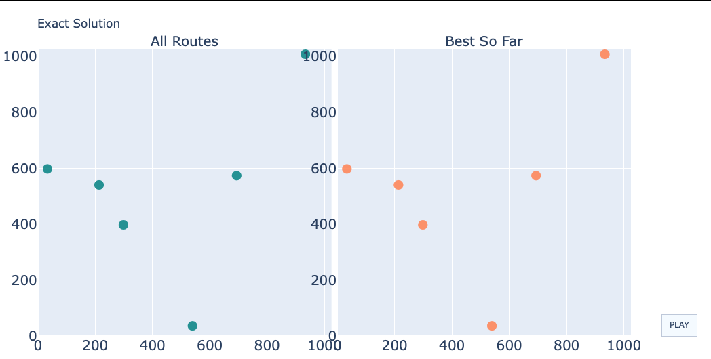
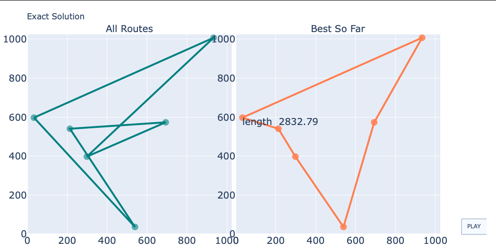
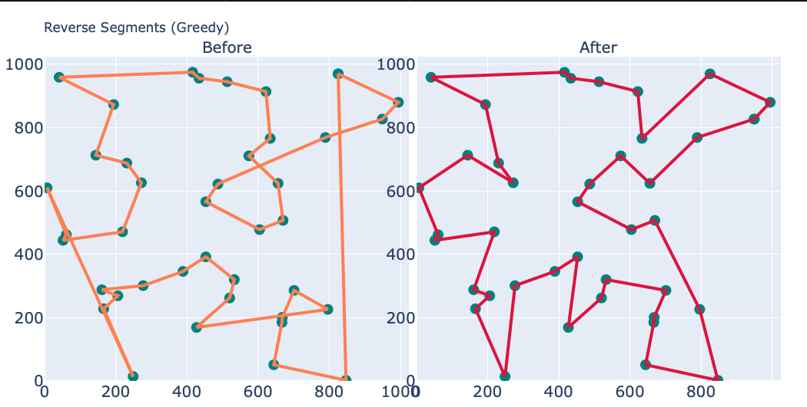

# Traveling Salesman Problem Exercise T1

## Traveling Salesman Problem

Traveling Salesman Problem (TSP) is to find the shortest route while
visiting all the cities that are given. Every city has to be visited,
but once. The salesman will come back to the city he started.

------------------------------------------------------------------
## How to run the Demo

1. Clone the repo.

2. Run following command on the command line.
   `> python3 tsp_demo.py`

   + At the prompt `Next? [Y]/n`, press `return` so that the program
     proceeds. Otherwise press `n`.
     
   + Visualization is provided by `plotly`. When plots show up on your
     browser,

     

     click `__PLAY__`. An animation will start.

     

------------------------------------------------------------------
## Results

We tried
  - exact solution
  - initial solutions to start with
  - one optimization algorithm ('reverse segmentation', also known as '2-opt')
  - one off-the-shelf optimization solver (`OR-Tools` by Google)


1. __Exact Solution is hard__ About 10 cities are the upper limit I
   could calculate with a laptop.

2. __Insertion Algorithms are similar__ At `n_city=99`, different
   initial solutions yield the tour-lengths not different by 8% from
   the best solution.

3. __Reversing segments works__ Straighten the crossings improves the
    solution significantly.



4. __OR-tools is simple__ `OR-Tools` and its Python wrapper makes the
    code short. The following is the entire function needed. `cities`
    is the list of coordinates of the cities.  `ortools_vrp` in the
    code is the python wrapper. 'vrp' stands for 'Vehicle Routing
    Problem'

```
def ortool_tsp(cities):

    x = [p.x for p in cities]
    y = [p.y for p in cities]

    df = pd.DataFrame(dict(x=x, y=y))
    dist = sci_dist.cdist(df.values, df.values).astype(int)
    route = ortools_vrp(len(df), dist, limit_time=1)[0]
    # 'ortools_vrp' is the python wrapper. 'vrp' stands for 'Vehicle Routing Problem'

    tour_initial = list(cities)
    tour_opt = [tour_initial[i] for i in route]

    return tour_opt, tour_initial
```

5. __OR-tools performs good__ Ortool consistently performs best in
   terms of the total length of the final tour. Mean total lengths
   over the 5 model-cities were calculated with each algorithm for
   comparison.

6.. __In particular with large map__ The execution times of handmade
   initial solutions increase exponentially with the number of cities
   in a tour.  For small numbers of cities, the optimization by
   ortools takes much longer than other initial-solution algorithms.
   However, the execution time changes little for larger numbers of
   cities when ortools optimization is used. The calculation
   performance of ortools overtakes others at around `n_city` =
   100-200.

------------------------------------------------------------------
## Directory Tree
```
.
├── .gitignore
├── LICENSE
├── README.md
├── html
│   ├── all_initial_solution.html
│   ├── benchmark.html
│   ├── cheapest_insertion.html
│   ├── exact_solution.html
│   ├── furthest_insertion.html
│   ├── greedy.html
│   ├── large_maps.html
│   ├── nearest_insertion.html
│   ├── nearest_neighbor.html
│   ├── ortool.html
│   ├── random_insertion.html
│   ├── reverse_segments.html
│   └── small_maps.html
├── images
│   ├── exact_solution_after.png
│   ├── exact_solution_before.png
│   └── reverse_segments.png
├── requirements.txt
├── tsp
│   ├── __init__.py
│   ├── __pycache__
│   │   ├── __init__.cpython-38.pyc
│   │   └── tsp.cpython-38.pyc
│   └── tsp.py
└── tsp_demo.py
 
```
### HTML files
They are made by `plotly` package, including animations. 

------------------------------------------------------------------
## Output
```
#====================
Exact Solution
n_cities 6
Next? [Y]/n

#====================
Nearest Neighbor
n_cities 40
Next? [Y]/n

#====================
Greedy
n_cities 40
Next? [Y]/n

#====================
Random Insertion
n_cities 40
Next? [Y]/n

#====================
Nearest Insertion
n_cities 40
Next? [Y]/n

#====================
Furthest Insertion
n_cities 40
Next? [Y]/n

#====================
Cheapest Insertion
n_cities 40
Next? [Y]/n

#====================
Ortool
n_cities 99
Next? [Y]/n

#====================
Benchmark
algorithm               mean   sdv   min    max   time[s]   rep city
nn_tsp                    8327    181  8113   8571   0.0314 5 99
greedy_tsp                8131     95  8019   8232   0.0255 5 99
random_insertion_tsp      8554    171  8263   8689   0.0200 5 99
nearest_insertion_tsp     8743    197  8465   8946   0.0524 5 99
furthest_insertion_tsp    8365    214  8094   8651   0.0481 5 99
cheapest_insertion_tsp    8739    233  8462   9084   0.0951 5 99
ortool_tsp                8129    143  7954   8277   1.0073 5 99
                algorithm         mean      stddev          min          max      time  n_rep  n_city    factor  first_length
0                  nn_tsp  8326.771881  180.628331  8113.353281  8570.860647  0.016937      5      99  1.024541   8272.529750
1              greedy_tsp  8130.625550   95.318985  8018.649649  8232.481261  0.021543      5      99  1.000407   8227.721192
2    random_insertion_tsp  8553.775633  171.033876  8263.314051  8689.137543  0.017752      5      99  1.052472   8543.409663
3   nearest_insertion_tsp  8742.797972  197.372903  8464.955223  8946.294189  0.053563      5      99  1.075730   8898.289467
4  furthest_insertion_tsp  8364.687822  214.036176  8093.922896  8650.558900  0.048412      5      99  1.029206   8093.922896
5  cheapest_insertion_tsp  8739.047500  233.216639  8462.479711  9083.778952  0.095908      5      99  1.075268   8650.303463
6              ortool_tsp  8127.319275  144.793311  7947.687107  8276.997270  1.026032      5      99  1.000000   8276.99727
Next? [Y]/n

algorithm               mean   sdv   min    max   time[s]   rep city
alltours_tsp              2622    170  2378   2828   0.0004 5  6
nn_tsp                    2629    169  2378   2828   0.0001 5  6
greedy_tsp                2622    170  2378   2828   0.0001 5  6
random_insertion_tsp      2622    170  2378   2828   0.0001 5  6
nearest_insertion_tsp     2622    170  2378   2828   0.0001 5  6
furthest_insertion_tsp    2622    170  2378   2828   0.0001 5  6
cheapest_insertion_tsp    2629    169  2378   2828   0.0001 5  6
ortool_tsp                2622    170  2378   2828   1.0018 5  6
algorithm               mean   sdv   min    max   time[s]   rep city
alltours_tsp              2829    402  2167   3181   0.0118 5  8
nn_tsp                    2857    425  2167   3278   0.0001 5  8
greedy_tsp                2857    425  2167   3278   0.0001 5  8
random_insertion_tsp      2857    425  2167   3278   0.0001 5  8
nearest_insertion_tsp     2857    425  2167   3278   0.0001 5  8
furthest_insertion_tsp    2837    402  2167   3181   0.0001 5  8
cheapest_insertion_tsp    2837    402  2167   3181   0.0001 5  8

ortool_tsp                2829    402  2167   3181   1.0015 5  8
algorithm               mean   sdv   min    max   time[s]   rep city
alltours_tsp              2947    214  2601   3188   1.2141 5 10
nn_tsp                    2947    214  2601   3188   0.0003 5 10
greedy_tsp                2947    214  2601   3188   0.0002 5 10
random_insertion_tsp      2972    254  2601   3315   0.0002 5 10
nearest_insertion_tsp     3000    303  2601   3452   0.0002 5 10
furthest_insertion_tsp    2947    214  2601   3188   0.0002 5 10
cheapest_insertion_tsp    2979    224  2601   3188   0.0002 5 10
ortool_tsp                2947    214  2601   3188   1.0017 5 10
algorithm               mean   sdv   min    max   time[s]   rep city
nn_tsp                    3574    371  2986   3884   0.0009 5 16
greedy_tsp                3532    296  3063   3814   0.0006 5 16
random_insertion_tsp      3650    544  2986   4483   0.0005 5 16
nearest_insertion_tsp     3640    574  3063   4512   0.0009 5 16
furthest_insertion_tsp    3602    239  3249   3814   0.0007 5 16
cheapest_insertion_tsp    3585    471  2986   4053   0.0012 5 16
ortool_tsp                3466    360  2986   3814   1.0020 5 16
algorithm               mean   sdv   min    max   time[s]   rep city
nn_tsp                    6670    266  6329   6972   0.0077 5 64
greedy_tsp                6622    231  6297   6926   0.0088 5 64
random_insertion_tsp      6767    198  6539   6986   0.0067 5 64
nearest_insertion_tsp     6998    276  6657   7362   0.0175 5 64
furthest_insertion_tsp    6835    165  6628   6981   0.0161 5 64
cheapest_insertion_tsp    7089    309  6766   7461   0.0292 5 64
ortool_tsp                6526    238  6196   6857   1.0034 5 64
algorithm               mean   sdv   min    max   time[s]   rep city
nn_tsp                   13194    213 13017  13536   0.1065 5 256
greedy_tsp               12872    373 12443  13452   0.2166 5 256
random_insertion_tsp     13369    339 13061  13932   0.1379 5 256
nearest_insertion_tsp    13627    225 13265  13803   2.0076 5 256
furthest_insertion_tsp   13301    294 12985  13612   1.9983 5 256
cheapest_insertion_tsp   13602    271 13277  13882   2.7750 5 256
ortool_tsp               12873    316 12464  13308   1.0632 5 256
```
------------------------------------------------------------------
## Further Discussion

### Model of a Tour

- Given number of 'Cities' are randomly distributed on 1024 x 1024
  pixel field.

- Euclid distance (straight-line distance between two points) are used
  as distances between the cities, as opposed to realistic
  travel-distances along roads or railways.

- Finding the order of the cities that amounts to the shortest total
  distance along the tour is the goal of TSP.


------------------------------------------------------------------
## TSP Overview

TSP consists of three parts,

1. Creating initial tour

2. Preparing algorithms to shorten the tour distance

3. Pick, discard, adjust the algorithms so that the tour distance is closer to the minimum


### Project Overview

In this project we performed the following. The items in the
parenthesis `()` are not performed but shown for the sake of the
discussion, or to be performed later.


0. Exact solution

1. Initial solutions
   + nearest neighbor
   + greedy algorithm

   + insertions
     - random
     - nearest     
     - furthest
     - cheapest

  (+ Minimum Spanning Tree [MST])
    (- Kruskal)
    ( - Prim))

2. Optimization technique
   + reversing segments

(3. Trial and Error)

4. Off-the-Shelf Solver
   + OR-Tools
   (+ Pulp)
   (+ MIP)

(5. Machine Learning Techniques)
   (+ reinforcement learning)

6. Benchmarking


#### Initial solutions quick overview

1. __Nearest Neighbor__ : Visit the nearest city from the present city.


2. __Greedy__ : Connect the shortest edges first until all the points are connected.

3. __Random Insertion__ : Pick one unvisited city randomly and put it in the nearest edge.

4. __Nearest Insertion__ : Pick one unvisited city that is the nearest to one the cities that were already visited.
                           Put it in the nearest edge.

4. __Furthest Insertion__ : Pick one unvisited city that is the furthest from the cities that were already visited.
                            Put it in the nearest edge.

5. __Cheapest Insertion__ : Pick one unvisited city where the insertion costs least. The cost to put the city `C`
to the edge `A-B` is calculated as follows. 

```
distance(A, C) + distance(B, C) - distance(A, B)
```


#### Optimization Technique

##### Reversing Segments

It is apparent that a crossing makes the route unnecessary longer.
The tour becomes shorter when the paths are straighten. 


```
(crossed)        =>    (straightened)

...--A    B--...       ...--A---B--...
      \  /
       \/
       /\
      /  \
...--C    D--...       ...--C---D--...

```

This amounts to reverse the segment `B-D`, and reconnect the segment
'D-B' to `A` and `C` again. The technique is also called '2-opt'.


##### Other Techniques

Optimization techniques are the quintessence/essence of TSP. There are
numbers of algorithms that are well studied.

  (+ 3-opt)
  (+ or-1-opt, or-2-opt)
  (+ Divide and Conquer) 
  (+ Simulated Annealing)
  (+ Genetic Algorithm)
  (+ Ant Colony Optimization)


#### Off-the-shelf Optimization Package

Other choices may be Pulp, MIP, etc. 

------------------------------------------------------------------
## Reference 
I used the following reference for coding.


(Modeling general)\
https://nbviewer.org/url/norvig.com/ipython/TSP.ipynb
(Insertions)\
https://y-uti.hatenablog.jp/entry/2017/11/04/135809
(Or-Tools)\
https://qiita.com/SaitoTsutomu/items/ab9d657c49879df69928
https://developers.google.com/optimization/routing/vrp

In particular this project heavily in debs to the notebook published
in the first reference. Not only the algorithms themselves, but the
style of the coding is highly elegant. I tried to follow the codes
there as precise as possible with minimum modifications.

------------------------------------------------------------------
END

